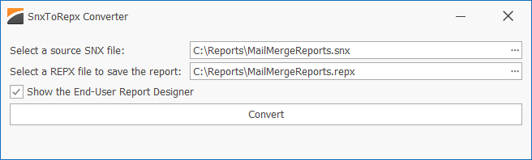

<!-- default badges list -->

<!-- default badges end -->
# Snap – Convert Your SNX Reports to REPX Files

As you may already know the [WinForms Snap](https://docs.devexpress.com/WindowsForms/11373/controls-and-libraries/snap) control is now in maintenance support mode. No new features and capabilities are incorporated into this product. We strongly recommend that you use our feature-rich [DevExpress Reporting](https://docs.devexpress.com/XtraReports/2162/reporting) tool to generate, edit, print, and export your business reports.

To help you migrate to DevExpress Reports, we created an application that allows you to convert your SNX report templates to REPX files.

## How to Convert Snap Reports to REPX Files

Download and run this application. Select an SNX file you need to convert to REPX and click **Convert**. The resulting report is opened in the [WinForms End-User Report Designer](https://docs.devexpress.com/XtraReports/8546/winforms-reporting/end-user-report-designer-for-winforms/gui/end-user-report-designer-with-a-ribbon-toolbar).

Handle the ConfigureDataConnection event if you need to update connection settings for your data source. Refer to the following help topic for details: [SqlDataSource.ConfigureDataConnection](https://docs.devexpress.com/CoreLibraries/DevExpress.DataAccess.Sql.SqlDataSource.ConfigureDataConnection).

## Limitations

Since Snap and DevExpress Reports use completely different formats and have incompatible feature sets, the conversion process has the following limitations:

* A Snap document can contain auxiliary controls (such as [checkboxes](https://docs.devexpress.com/WindowsForms/14803/controls-and-libraries/snap/graphical-user-interface/data-visualization-tools/check-box)) within formatted text. Since a DevExpress Report does not support this functionality, the converter uses textual representation for Snap content controls. This means that the resulting report contains the "True" and "False" strings instead of checkboxes.
* A Snap document can contain multiple sections with different page settings. A DevExpress Report cannot use different page settings in the same report, so only the first section settings are taken into account during conversion.
* In Snap, different data sources can contain calculated fields that have the same name. To avoid potential conflicts in DevExpress Reports, we disabled the ability to add fields with the same name.
* Snap allows you to create a multi-column layout with completely different elements. A DevExpress Report does not support this layout, so the converter creates a single-column report.
* [XRTableCell](https://docs.devexpress.com/XtraReports/DevExpress.XtraReports.UI.XRTableCell) and [XRLabel](https://docs.devexpress.com/XtraReports/DevExpress.XtraReports.UI.XRLabel) uses expressions and HTML-style markup to build and format content. If these objects have nested controls, markup and expressions are ignored and only nested controls are visible. Snap allows you to place any content within a table cell (including multiple nested table levels). There is no generic solution for automatic conversion of this content to DevExpress Reports.
* Detail [Snap lists](https://docs.devexpress.com/WindowsForms/DevExpress.Snap.Core.API.SnapList) do not have the `DataSource` property specified. Instead, they use the parent's data source. DevExpress Reports require the `DataSource` property to be set. Moreover, the `DataMember` property should contain a full path to the data member (for example, "Products.ProductOrders" in DevExpress Reports, while Snap uses "ProductOrders" in this case). You need to correct the `DataSource` and `DataMember` properties for each [DetailReportBand](https://docs.devexpress.com/XtraReports/DevExpress.XtraReports.UI.DetailReportBand) object after conversion.
* DevExpress Reports do not differentiate between first/primary/odd/even headers and footers. So, the converter processes only the primary header and footer of a Snap report.
* Snap allows you to place page fields at any position within formatted text. A DevExpress Report does not support this functionality, so all fields in headers and footers are converted to static values.
* Static text in a Snap report is converted to markup. Markup with different format settings starts with a new line.

If you encountered an issue while using our converter app, please [submit a ticket to our DevExpress Support Center](https://supportcenter.devexpress.com/ticket/create).
